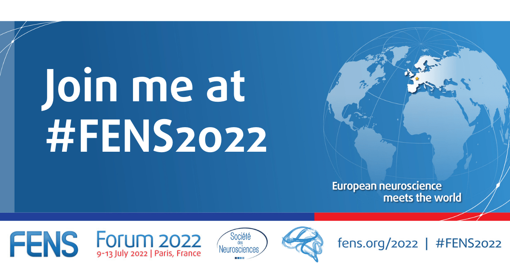

I am beyond thrilled for my first **in person** conference, the FENS Forum 2022 in Paris. I will be presenting a project I worked on during the [Neuromatch Academy in Computational Neuroscience](https://portal.neuromatchacademy.org/) in 2021.

You can learn about it on Sunday, July 10th in the afternoon session, at Poster S02-561: "Four grid cell modules can code for a precise location at a low error"

{: .mx-auto.d-block :}

